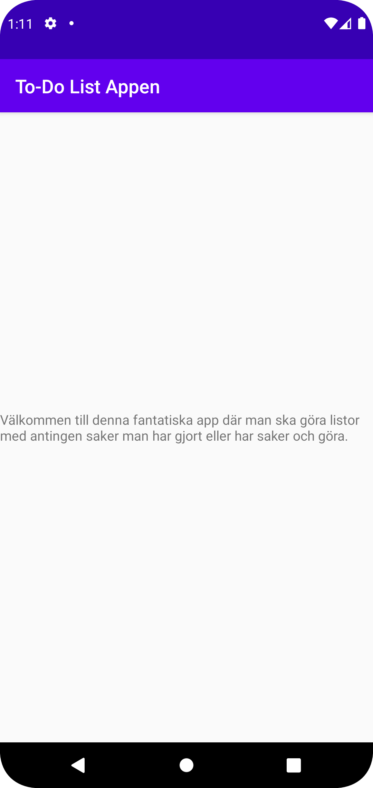

# Rapport

**Skriv din rapport här!**
I den första frågan var det att göra tre olika ändringarna i appen och jag gjorde utifrån vad som jag har lärt mig hittlis och dem tre ändringarna var följande börja med att byta 
appnamnet på titlen, sedan så ändrad jag android texten som fanns på appen och sedan gav jag internet återkomst till appen för det var några saker som man har lärt sig innan. 

Programkod ska se ut som exemplet nedan. Koden måste vara korrekt indenterad då den blir lättare att läsa vilket gör det lättare att hitta syntaktiska fel.

```
Ändring 1
<resources>
    <string name="app_name">To-Do List Appen</string>
</resources>

Ändring 2
android:text="Välkommen till denna fantatiska app där man ska göra listor med antingen saker man har gjort eller har saker och göra."

Ändring 3
<uses-permission android:name="android.permission.INTERNET" />

Detta är dem tre följande ändringarna som har gjorts på första frågan. byta appnamnet på titlen, sedan så ändrad jag android texten som fanns på appen och sedan gav jag internet återkomst till appen för det var några saker som man har lärt sig innan.
```

Bilder läggs i samma mapp som markdown-filen.



Läs gärna:

- Boulos, M.N.K., Warren, J., Gong, J. & Yue, P. (2010) Web GIS in practice VIII: HTML5 and the canvas element for interactive online mapping. International journal of health geographics 9, 14. Shin, Y. &
- Wunsche, B.C. (2013) A smartphone-based golf simulation exercise game for supporting arthritis patients. 2013 28th International Conference of Image and Vision Computing New Zealand (IVCNZ), IEEE, pp. 459–464.
- Wohlin, C., Runeson, P., Höst, M., Ohlsson, M.C., Regnell, B., Wesslén, A. (2012) Experimentation in Software Engineering, Berlin, Heidelberg: Springer Berlin Heidelberg.
